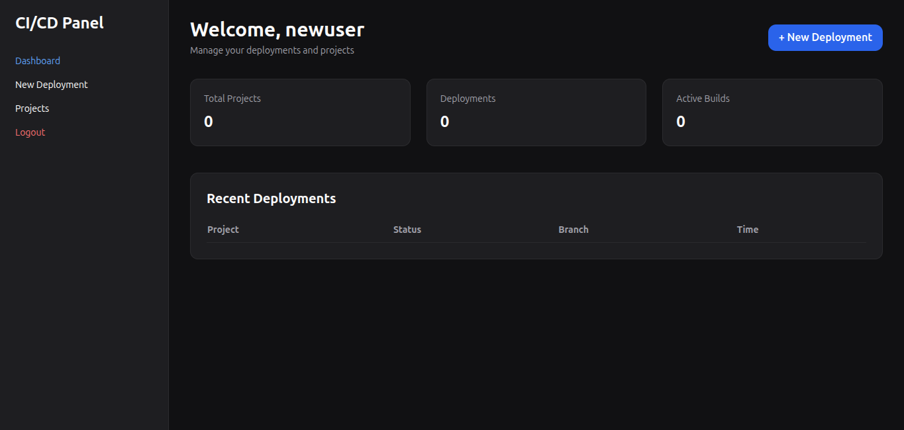
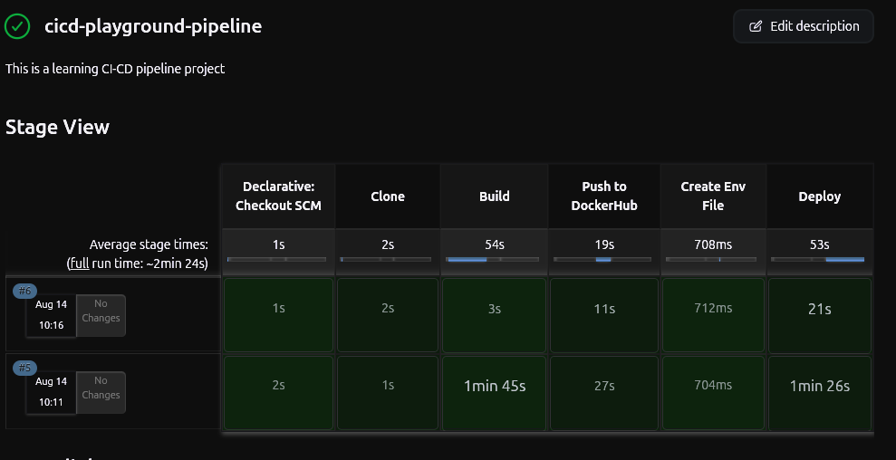

# 🚀 CI/CD Playground

> A self-hosted CI/CD practice platform where users can register, log in, and deploy their own GitHub-hosted applications through an automated Docker + Jenkins pipeline.

CI/CD Playground is a DevOps-focused project built to understand and practice the complete application deployment lifecycle — from source code retrieval and Docker image creation to automated container deployment.

The project combines a Node.js web application with Jenkins and Docker to provide a simple interface for triggering application deployments from GitHub repositories.

---

## 📌 Project Overview

CI/CD Playground allows users to:

- Create an account and securely log in.
- Provide a GitHub repository URL.
- Select the branch they want to deploy.
- Trigger an automated deployment pipeline.
- Clone the repository.
- Build a Docker image.
- Run the application inside a Docker container.
- Automatically detect the application's exposed port.
- Access the deployed application through a generated URL.
- Monitor deployment logs through the web interface.

The primary goal of this project was to gain practical experience with **DevOps, CI/CD automation, containerization, Jenkins, Docker, and deployment workflows**.

---
## 📸 Screenshots

### Login


### Deployment Dashboard



### Deployment Creation


### Successful Deployment


### Jenkins Pipeline


## ✨ Features

### 👤 Authentication

- User registration
- User login/logout
- Password hashing
- Session/cookie-based authentication
- Protected deployment functionality

### 📦 GitHub-Based Deployment

Users can provide:

- GitHub repository URL
- Git branch

The platform then automatically retrieves the source code and starts the deployment process.

### 🔄 Automated CI/CD Pipeline

The deployment workflow performs:

```text
GitHub Repository
       ↓
    Clone Code
       ↓
   Build Docker Image
       ↓
 Detect Exposed Port
       ↓
 Start Container
       ↓
Assign Host Port
       ↓
Generate Application URL
````

### 🐳 Docker Containerization

The application and deployment workflow use Docker to provide isolated application environments.

Each deployment:

* Builds a Docker image.
* Creates a separate container.
* Dynamically maps the application's exposed port.
* Runs the application independently.

### 🔍 Automatic Port Detection

The deployment system does not assume that every application runs on port `3000`.

Instead, it inspects the Docker image and detects the port declared using:

```dockerfile
EXPOSE <PORT>
```

For example:

```dockerfile
EXPOSE 5000
```

or:

```dockerfile
EXPOSE 3000
```

The system dynamically maps the detected container port to an available host port.

### 📜 Deployment Logs

Deployment progress is displayed through the application interface.

Example:

```text
Deployment started
Repository cloned successfully
Building Docker image...
Docker image built successfully
Detecting exposed port...
Detected container port: 5000
Starting Docker container...
Container started successfully
Application available at http://localhost:32769
Deployment completed successfully
```

### 🎨 Responsive UI

The frontend is built using:

* EJS
* Tailwind CSS

The interface provides pages for authentication, deployment configuration, and deployment monitoring.

---

# 🏗️ Architecture
                  ┌──────────────┐
                  │     User     │
                  └──────┬───────┘
                         │
                         ▼
              ┌─────────────────────┐
              │  CI/CD Playground   │
              │ Node.js + Express   │
              │ EJS + Tailwind CSS  │
              └──────────┬──────────┘
                         │
             ┌───────────┴───────────┐
             │                       │
             ▼                       ▼
       ┌───────────┐          ┌─────────────┐
       │  MongoDB  │          │   GitHub    │
       └───────────┘          └──────┬──────┘
                                     │
                                     ▼
                              ┌─────────────┐
                              │    Docker   │
                              │ Build Image │
                              │ Run         │
                              │ Container   │
                              └──────┬──────┘
                                     │
                                     ▼
                            Deployed Application

# 🔄 Deployment Workflow

When a user starts a deployment, the following process takes place:

### 1. User Authentication

The user registers or logs into the platform.

Authentication protects deployment functionality from unauthorized access.

### 2. Repository Configuration

The user provides:

```text
GitHub Repository URL
Branch
```

Example:

```text
Repository:
https://github.com/example/my-app

Branch:
main
```

### 3. Repository Cloning

The deployment service clones the selected branch:

```bash
git clone -b main <repository-url>
```

### 4. Docker Image Creation

The application repository is used as the Docker build context.

```bash
docker build -t <image-name> .
```

### 5. Port Detection

The generated Docker image is inspected to determine which application port is exposed.

For example:

```dockerfile
EXPOSE 5000
```

The deployment system automatically detects `5000`.

### 6. Container Creation

The application is started inside a Docker container.

The container port is mapped to an available host port.

Example:

```text
localhost:32769 → container:5000
```

### 7. Deployment URL

Once the container is running, the system determines the dynamically assigned host port and generates an application URL.

Example:

```text
http://localhost:32769
```

### 8. Deployment Completion

The deployment status and logs are returned to the user.

---

# 🛠️ Tech Stack

| Technology   | Purpose                      |
| ------------ | ---------------------------- |
| Node.js      | Backend runtime              |
| Express.js   | Web framework                |
| EJS          | Server-side rendering        |
| MongoDB      | Database                     |
| Mongoose     | MongoDB ODM                  |
| Tailwind CSS | UI styling                   |
| Docker       | Application containerization |
| Jenkins      | CI/CD automation             |
| Git          | Version control              |
| GitHub       | Source code hosting          |

---

# 📁 Project Structure

```text
cicd-playground/
│
├── configs/
│   └── config.js
│
├── controllers/
│   └── ...
│
├── middleware/
│   └── ...
│
├── models/
│   └── ...
│
├── routes/
│   └── ...
│
├── services/
│   └── ...
│
├── views/
│   ├── layouts/
│   ├── auth/
│   ├── dashboard/
│   └── ...
│
├── public/
│   └── ...
│
├── Dockerfile
├── Jenkinsfile
├── docker-compose.yml
├── package.json
├── package-lock.json
└── README.md
```

> The exact structure may vary depending on the current implementation.

---

# ⚙️ Getting Started

## Prerequisites

Make sure the following are installed:

* Node.js
* npm
* Docker
* Docker Compose
* MongoDB
* Jenkins
* Git

---

## 1. Clone the Repository

```bash
git clone https://github.com/Amit021020/cicd-playground.git
```

```bash
cd cicd-playground
```

---

## 2. Install Dependencies

```bash
npm install
```

---

## 3. Configure Environment Variables

Create a `.env` file:

```env
PORT=3000
MONGO_URI=mongodb://localhost:27017/cicd-playground
JWT_SECRET=your_secret_key
```

Never commit your `.env` file to GitHub.

Add it to `.gitignore`:

```gitignore
.env
node_modules/
```

---

# 🐳 Running with Docker

Build the image:

```bash
docker build -t cicd-playground .
```

Run the container:

```bash
docker run -p 3000:3000 cicd-playground
```

The application should then be available at:

```text
http://localhost:3000
```

---

# 🧩 Running with Docker Compose

If Docker Compose is configured:

```bash
docker compose up --build
```

To run in detached mode:

```bash
docker compose up -d --build
```

To stop the services:

```bash
docker compose down
```

---

# 🔧 Jenkins Setup

CI/CD Playground uses Jenkins to automate the deployment workflow.

A typical pipeline consists of stages such as:

```text
Clone
  ↓
Build
  ↓
Docker Image
  ↓
Push / Deploy
  ↓
Run Container
```

The Jenkins pipeline can be triggered through the Jenkins interface or integrated with the application's deployment workflow.

### Jenkins Requirements

Install/configure:

* Jenkins
* Docker
* Git
* Required Jenkins plugins
* Docker permissions for the Jenkins user

Make sure Jenkins can execute Docker commands:

```bash
docker ps
```

If Jenkins cannot access Docker, the pipeline will fail during Docker-related stages.

---

# 🔐 Security Considerations

This project is primarily designed as a **DevOps learning and practice project**, not as a production-grade deployment platform.

Some important security considerations for a production implementation would include:

* Never execute arbitrary Docker builds without isolation.
* Validate and sanitize GitHub repository URLs.
* Restrict container privileges.
* Avoid running containers as root.
* Apply CPU and memory limits.
* Implement deployment timeouts.
* Prevent container escape.
* Implement network isolation.
* Secure Jenkins credentials.
* Use HTTPS.
* Implement rate limiting.
* Add proper authorization and role management.
* Scan Docker images for vulnerabilities.
* Store secrets using a dedicated secret-management system.

These would be necessary before exposing the platform publicly.

---

# 🎯 Project Goals

The main purpose of this project was to gain hands-on experience with:

* CI/CD concepts
* Jenkins pipelines
* Docker containerization
* Automated deployments
* Git and GitHub workflows
* Linux process management
* Dynamic Docker port mapping
* Backend development
* Database integration
* Deployment logging
* Infrastructure automation

Rather than simply deploying one application manually, the project focuses on building a system capable of **accepting an application repository and automatically deploying it**.

---

# 🚀 Future Improvements

Possible improvements include:

* [ ] GitHub webhook-based automatic deployments
* [ ] Deployment history
* [ ] Deployment rollback
* [ ] Container health checks
* [ ] Application health monitoring
* [ ] Prometheus metrics
* [ ] Grafana dashboards
* [ ] Kubernetes-based deployments
* [ ] Multi-container application support
* [ ] Docker image vulnerability scanning
* [ ] Resource limits for deployed containers
* [ ] Deployment cancellation
* [ ] Automatic cleanup of stopped containers
* [ ] HTTPS for deployed applications
* [ ] Custom subdomains
* [ ] Build artifacts
* [ ] Real-time WebSocket deployment logs
* [ ] Role-based access control

---

# 📊 What I Learned

Building this project gave me practical exposure to the complete path from source code to running application:

```text
Source Code
     ↓
GitHub
     ↓
Jenkins
     ↓
Docker Build
     ↓
Docker Container
     ↓
Application Deployment
```

It also helped me understand that CI/CD is more than simply writing a Jenkinsfile. A functional deployment system requires handling:

* Build failures
* Docker errors
* Port conflicts
* Container lifecycle
* Environment variables
* Deployment logs
* Authentication
* Dynamic ports
* Process management
* Failure handling

---

# 💡 Why I Built This

I built CI/CD Playground as a hands-on project to move beyond theoretical DevOps knowledge and actually implement a deployment workflow.

The goal was to understand how platforms can automate the journey from a developer pushing code to GitHub to an application running inside a container.

---

# 👨‍💻 Author

**Amit Suyal**

Built as a hands-on DevOps project to understand CI/CD automation, Docker containerization, Jenkins pipelines, GitHub-based deployments, and application lifecycle management.
---

## ⭐ If You Found This Project Useful

If this project helped you understand CI/CD, Docker, or Jenkins, consider giving the repository a ⭐.


